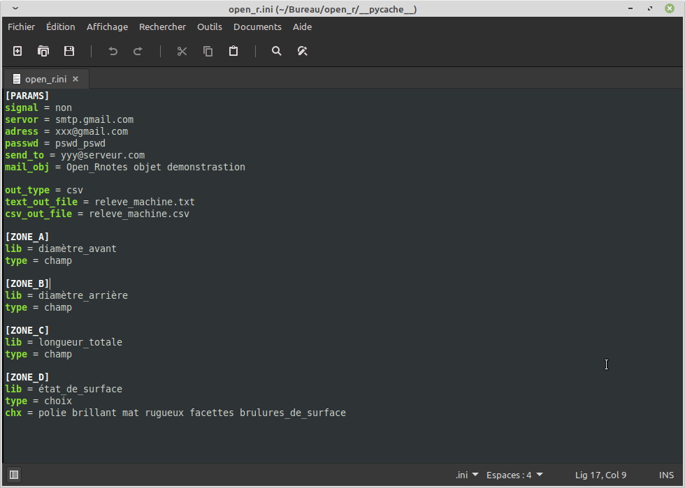
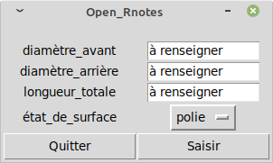
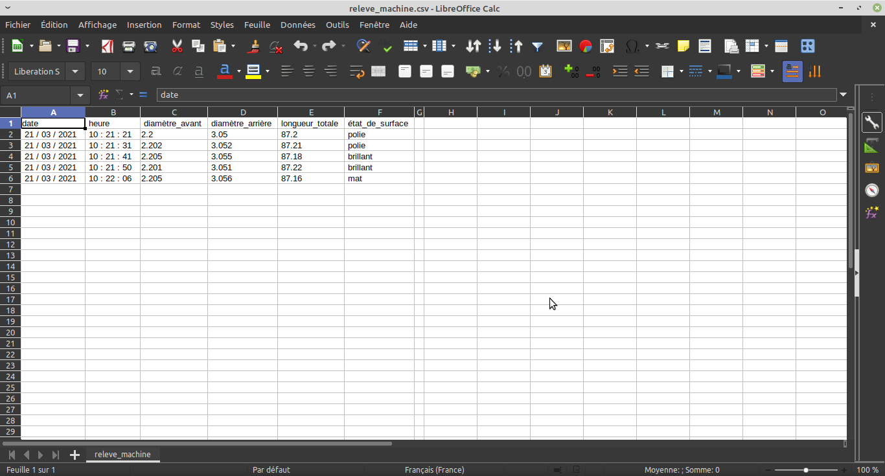

## Open_Rnotes
#### Application de saisie simplifiée pour Linux, Mac et Windows
------

  Ce dépôt concerne mon application Open_Rnotes, et contient le code source en Python3. Si vous avez Python en version 3.8 installé sur votre machine, vous pouvez exploiter ce programme en version opensource directement.  

  Cette application permet de déployer facilement et rapidement un moyen de saisir des données dans un format texte ou CSV. Elle est entièrement paramétrable par l'utilisateur, juste en modifiant son fichier de configuration open_r.ini. Pour savoir comment s'y prendre, il suffit de suivre les instructions dans ce fichier de configuration et de le mettre à votre sauce ;) .  

  Je suis actuellement en train de bosser sur un rajout de fonctionnalités permettant d'utiliser une base de données SQLite3, et une autre permettant de faire une lecture rapide du fichier de relevé, directement depuis l'application.  

  Il est possible également de lui faire envoyer un mail à une adresse prédéfinie, en utilisant un serveur de messagerie de type SMTP. (Google, Yahoo, etc...)  

  Je tiens à préciser que, pour pouvoir envoyer des mails avec cette application (j'ai utilisé Gmail pour base de messagerie ici), il faut au préalable activer le paramètre 'Accès moins sécurisé des applications'. Vous le trouverez à l'emplacement suivant depuis votre boite Gmail :  

    Boite Gmail
        +- Paramètres
            +- Comptes et importation
                +- Autres paramètres de votre compte Google
                    +- Sécurité
                        +- Accès moins sécurisé des applications

  N'importe quel serveur de messagerie permet ce genre de contrôle normalement. Ici c'est le cas de Google! Un update de sécurité est en cours de développement concernant l'usage du mot de passe. Pour vous simplifier la tâche et ne pas courir de risque avec votre boite email principale, prenez vous 10 minutes et faites vous une adresse email sous Google pour pouvoir vous en servir avec cette application.  

  Un fichier zip viendra également s'intégrer dans le dépot ici présent contenant une version exécutable autonome pour les utilisateurs de Windows qui ne souhaitent pas utiliser la version opensource en Python3. Cette version ne nécessitera pas d'installation, et ne pourra tourner que sous Windows10 (désolé pour ceux qui font de la résistance en utilisant la version 7)  

------

  Voici un exemple rapide, ce qu'il est possible de faire.  

  Supposons que vous travaillez dans une unité de production, et que vous vouliez réaliser un suivi des variations d'une machine, du genre SPC (Statistic Process Control), sur un lot de pièces. Supposons qu'il y a deux diamètres à vérifier, une longueur et un état de surface. Avec Open-Rnotes, il est possible de déployer l'application de façon à ce que l'opérateur puisse saisir rapidement ces données. Le fichier de configuration open_r.ini ressemblera à ceci (sans les commentaires):  

    [PARAMS]
    signal = non
    servor = smtp.gmail.com
    adress = xxx@gmail.com
    passwd = pswd_pswd
    send_to = yyy@serveur.com
    mail_obj = Open_Rnotes objet demonstrastion

    out_type = csv
    text_out_file = releve_machine.txt
    csv_out_file = releve_machine.csv

    [ZONE_A]
    lib = diamètre_avant
    type = champ

    [ZONE_B]
    lib = diamètre_arrière
    type = champ

    [ZONE_C]
    lib = longueur_totale
    type = champ

    [ZONE_D]
    lib = état_de_surface
    type = choix
    chx = polie brillant mat rugueux facettes brulures_de_surface

  Ceci va générer quatres zones dans l'application, et à chaque saisie, les données seront renseignées dans un fichier nommé 'releve_machine.csv' (voir le second groupe de paramètres de la section 'PARAMS'). Je tiens à préciser qu'il est possible de renseigner un ensemble 'chemin d'accès + nom du fichier' pour la sauvegarde. Dans ce cas de figure, aucun mail ne sera envoyé (voir le premier groupe de paramètres de la section 'PARAMS'). Les trois premières zones seront des champs de saisies, qui permet à l'utilisateur de saisir une valeur. La dernière zone définie sera une liste de choix que l'utilisateur pourra sélectionner.  

  Dans le cas d'une liste de choix, le paramètre 'chx' permet de donner une liste. Chaque espace délimite une valeur. Si vous voulez intégrer des valeurs composées de plusieurs mots, il faudra les relier entre eux par un underscore (_), tout simplement.  

  La liste de choix permettra dans le cas d'un fichier CSV (Excel), de créer comme un filtre. Ceci peut être interessant par la suite pour exploiter les données dans un fichier Excel, si vous avez besoin de créer un tableau statistique par exemple.  

  Voici quelques captures d'écrans pour vous montrer le résultat :  

  Le fichier de configuration.

  Le rendu visuel de l'application.

  Le relevé dans un fichier CSV.

  Et voilà.  

------

  Pour finir, il faut savoir que cette application est sous license de type MIT.  
  Bonne utilisation à tous.  

  Daniel, 20 mars 2021
